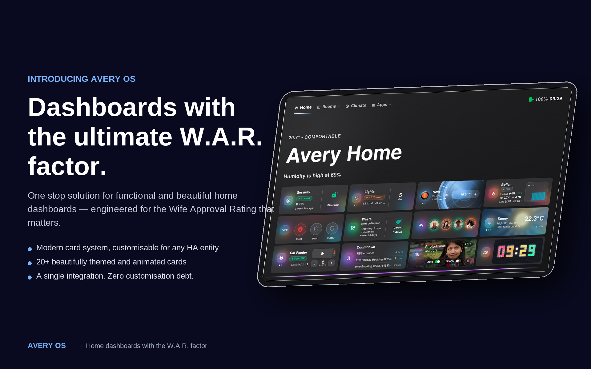

<!-- Banner: replace images/banner.png with a wide hero (≈1280×400) -->

  

<h1 align="center">Avery HAS OS</h1>

  <strong>A designed smart-home suite for Home Assistant. 
  One install — a whole dashboard experience that feels like one product.</strong>

  
  
  
  

<!-- Hero screenshot: replace images/dashboard.png with your best Avery dashboard -->

  

---

## Why Avery HAS OS?

Home Assistant is powerful, but its dashboards are a pile of parts. **Avery HAS OS
is a single, designed suite** — cards and themes crafted to look like they belong
together. Install one thing, and your whole dashboard levels up.

- 🎁 **One install, everything included** — no hunting for individual cards. Install
  Avery HAS OS and the whole free suite of cards *and* themes is instantly ready
  in your dashboards.
- 🎨 **A real design system** — every card and theme shares the same look, spacing,
  and polish. Cohesive, not cobbled together.
- 🧱 **Completely self-contained** — **no other cards or add-ons required.** No
  card-mod, no custom CSS, no YAML. Every Avery card is fully configurable right
  in the dashboard UI — colours, glow, radius, layout — with settings built in.
- 🪶 **Light & private** — no cloud, no account, no tracking. It just runs.
- 🔓 **Free forever core** — the baseline is open source and free. Always.

## ✨ Included — free with every install

Install Avery HAS OS and these are immediately available in your **＋ Add Card**
picker, plus the themes in your theme selector. Nothing else to download.

| | Card | What it does |
|---|------|--------------|
| 🧩 | **Modern Card** | The flagship — tile, status, and hero/room views in one, with climate, security, presence, and lights. |
| 🕹️ | **Pixel Clock** | An LED-matrix clock with built-in named timers & alarms. |
| ⛅ | **Weather** | A clean, designed weather card. |
| ☰ | **Menu** | A sleek navigation menu for moving around your dashboards. |
| 🏷️ | **Room Name** | A tidy room/section header to label areas of your home. |
| ➖ | **Divider** | Elegant section dividers to structure your dashboards. |
| 🎨 | **Themes** | *Avery*, *Avery Frosted Glass*, and *Avery Dark Glass* — the signature Avery look. |

<!-- Optional: images/free-suite.png — a grid showing the free cards + themes -->

  

## 🔑 Avery Premium — unlock the full suite

Want more? **Avery Premium** adds a whole collection of richer cards. Buy a key,
paste it into Avery HAS OS, and they instantly appear as configurable cards in your
dashboards — no extra installs, no fuss. No key, no clutter: you only ever see what
you own.

| | Card | What it does |
|---|------|--------------|
| 🤖 | **Jarvis** | A voice-assistant experience — a floating, always-there assistant for your home. |
| 📅 | **Calendar** | A beautiful combined calendar across all your sources. |
| 🖼️ | **Photo Frame** | Turn any dashboard into a rotating photo display. |
| ✅ | **To-Do** | Designed task lists that actually look good. |
| 🛒 | **Grocery** | A smart, aisle-aware shopping list. |
| 🌡️ | **Nest** | A rich Nest thermostat & climate card. |
| 📹 | **Blink + CCTV** | Live camera views and motion clips, beautifully presented. |
| 🐾 | **Cat** | A playful pet-status card. |
| ⏳ | **Countdown** | Count down to the moments that matter. |
| 🎵 | **Music Player** | A gorgeous media player for your whole home. |
| ♨️ | **Thermostat** | An advanced climate dial with fine control. |
| 💡 | **Light Group** | Group and control your lights with style. |
| 📺 | **LG TV** | Full control of your LG (webOS) television. |
| 🔌 | **Appliances & Events** | Appliance status and household events at a glance. |

<!-- Optional: images/premium-suite.png — a grid teasing the premium cards -->

  

> **How unlocking works:** premium cards are delivered only to key-holders. Enter a
> valid key in Avery HAS OS and it fetches and enables them — they show up in the
> add-card picker automatically. Everything you had free stays free.

## Installation

### HACS

1. In HACS, open the **⋮** menu → **Custom repositories**.
2. Add `https://github.com/avery-has-developer/avery-has-os` with category **Integration**.
3. Search for **Avery HAS OS** in HACS and **Download** it.
4. **Restart Home Assistant.**
5. Go to **Settings → Devices & Services → Add Integration → Avery HAS OS**.

That's it — the free cards and themes are now ready in your dashboards.

### Unlocking Premium

Open Avery HAS OS in **Settings → Devices & Services**, and paste your license key.
The premium cards appear in the add-card picker within moments.

## Roadmap & honesty

Avery HAS OS is **free today** and the baseline always will be — open source, no
strings. Premium is how the project sustains itself; it's entirely optional, and
nothing that's free will ever move behind the paywall. Built in the open, as a
labour of love.

## Credits & license

The free framework, cards, and themes are licensed under the **Apache License 2.0**
— see [`LICENSE`](LICENSE) and [`NOTICE`](NOTICE). Built for
[Home Assistant](https://www.home-assistant.io/), with thanks to its community.
